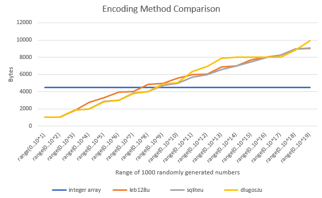

Variable Length Integer Encoding
================================

[](https://travis-ci.org/bright-tools/varints)

This is a Python module which is intended to assist with variable-length encoding integers (and lists of integers) into more compact representations which use less memory.

Implementation
--------------

This implementation is intended to work on Python 2 & Python 3 & will be published as 'varints' on [PyPI](https://pypi.python.org/pypi)

Notes on Memory Usage
---------------------

Generally in Python, integers are stored as [long](https://docs.python.org/2/library/stdtypes.html#numeric-types-int-float-long-complex) meaning that they will use at least 32 bits.  When storing many numbers which do not require 32 bits, this would seem to be significantly wasteful; variable length representation should be able to assist in such cases.

Unfortunately, Python 2 gives us the following

```python
>>> import sys
>>> i = 1
>>> sys.getsizeof(i)
12
>>> b = bytearray([0] * 4)
>>> sys.getsizeof(b)
29
```

and the situation is no better in Python 3

```python
>>> import sys
>>> i = 1
>>> sys.getsizeof(i)
14
>>> b = bytearray([0] * 4)
>>> sys.getsizeof(b)
33
```

What we can see however is that the Python overhead for bytearray is fixed.  Increasing the size of the bytearray only increases the memory usage by the amount of bytes we've used:

```python
>>> import sys
>>> b1 = bytearray([0])
>>> sys.getsizeof(b1)
30
>>> b10 = bytearray([0] * 10)
>>> sys.getsizeof(b10)
40
```

So this means that currently:
* Memory overhead for bytearray objects is higher in Python 3 than Python 2
* Using varint encoding will actually *cost* us memory rather than saving us memory

If we consider arrays of numbers the situation is somewhat better.  If we take the example where we want to store ten zeros.  A varint encoding should mean that each zero can be stored in a single byte, meaning that we'd end up with a bytearray with 10 elements.  So ...

```python
>>> import sys
>>> i1 = [0] * 10
>>> i1
[0, 0, 0, 0, 0, 0, 0, 0, 0, 0]
>>> sys.getsizeof(i1)
72
>>> b1 = bytearray(i1)
>>> sys.getsizeof(b1)
36
```

Meaning that:
* There is potential for saving memory by utilising varint encoding if we are storing arrays of integers
  * The amount of memory we save will depend on the numbers that are being stored.  The larger the varint representation, the smaller the saving, hence the more numbers will need to be stored in order to compensate for the bytearray overhead
* We will incur a processing overhead in order to save this memory.  e.g.  
  * Random access to varints stored in a bytearray would be O(n) rather than O(1)
  * We will incur an overhead each time we want to convert to and from varint representation

So why use varint in Python?  In the case that we need a compact method to store a list of (frequently small) numbers, and we do not generally need random access to the numbers contained.

One application is during [tree-search](https://en.wikipedia.org/wiki/Search_tree).  Typically we will end up with a number of nodes held in memory and not being accessed while other nodes in the tree are being processed.  If we want to store a state associated with each node (e.g. pieces on a chess board), then we can represent these as as list of integers and minimise the memory usage by using varint representations.

varint representations
----------------------

There are a number of different, etablished methods for variable-length integer encoding.  varints currently implements

| Representation | Notes |
| -------------- | ----- |
| [SQLite](https://sqlite.org/src4/doc/trunk/www/varint.wiki) | Positive integers only (varints.sqliteu) |
| [LEB128](https://en.wikipedia.org/wiki/LEB128) | Positive integers only
(varints.leb128u) |

Performance
-----------

The following example demonstrates the saving (using 32-bit Python 2) over 1000 random numbers in the range 0..1000

```python
>>> import varints
>>> import sys
>>> import random
>>> nums = [random.randint(0,1000) for _ in xrange(1000)]
>>> sys.getsizeof(nums)
4512
>>> var = varints.sqlite.encode( nums )
>>> sys.getsizeof(var)
1816
```

The following table shows the performance of the different implementations over a number of different ranges, using randomly generated data.  The measurements were taken using Python 3

| representation |  range(0,10^1) | range(0,10^2) | range(0,10^3) | range(0,10^4) | range(0,10^5) | range(0,10^6) | range(0,10^7) | range(0,10^8) | range(0,10^9) | range(0,10^10) | range(0,10^11) | range(0,10^12) | range(0,10^13) | range(0,10^14) | range(0,10^15) | range(0,10^16) | range(0,10^17) | range(0,10^18) | range(0,10^19) |
| integer array  |  4516 | 4516 | 4516 | 4516 | 4516 | 4516 | 4516 | 4516 | 4516 | 4516 | 4516 | 4516 | 4516 | 4516 | 4516 | 4516 | 4516 | 4516 | 4516 |
| leb128u        |  1017 | 1017 | 1799 | 2776 | 3329 | 3949 | 4011 | 4832 | 5000 | 5557 | 5973 | 6013 | 6926 | 7010 | 7731 | 7987 | 8289 | 8939 | 9011 |
| sqliteu        |  1017 | 1017 | 1896 | 2005 | 2852 | 2997 | 3805 | 3986 | 4729 | 4980 | 5681 | 5974 | 6566 | 6976 | 7455 | 7965 | 8286 | 8939 | 9077 |
| dlugoszu       |  1017 | 1017 | 1892 | 2010 | 2838 | 2999 | 3804 | 3984 | 4873 | 5006 | 6301 | 6949 | 7903 | 8005 | 8016 | 8017 | 8017 | 8841 | 9913 |



Other Implementations
---------------------

* [Implementation in C++](https://github.com/stoklund/varint)
* [LEB128 in Python - PyPI varint](https://github.com/fmoo/python-varint)
